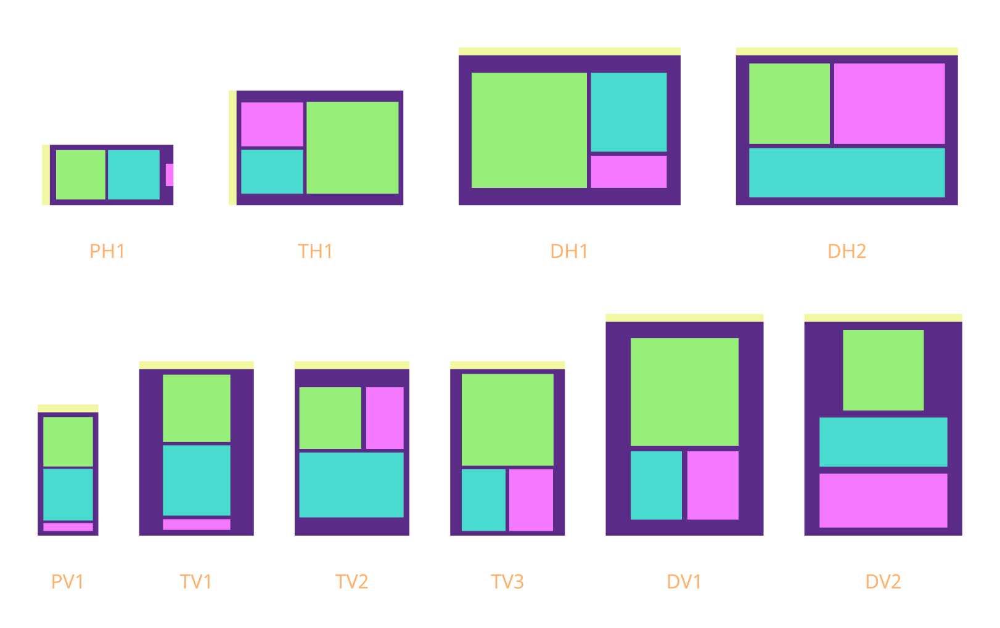
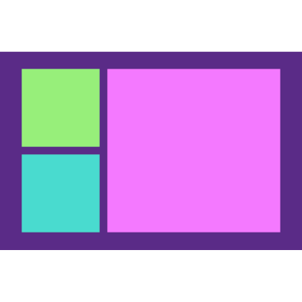
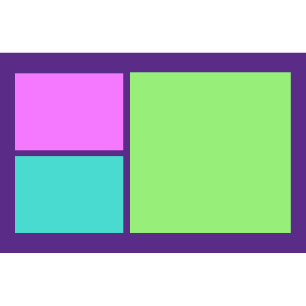
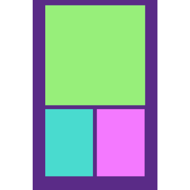
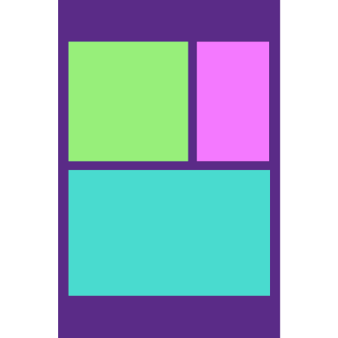
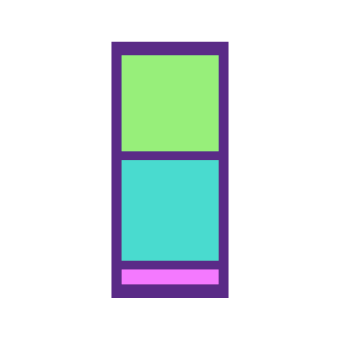
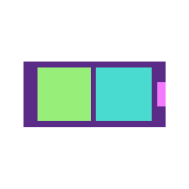
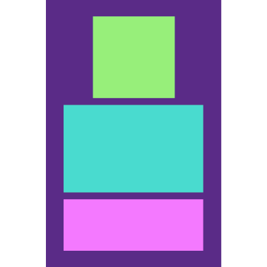
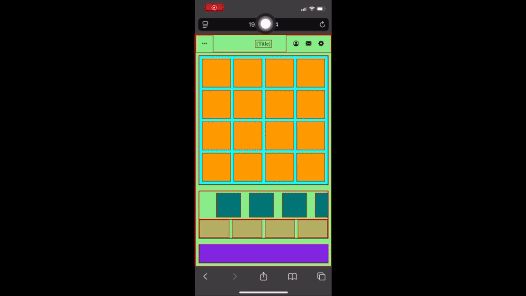
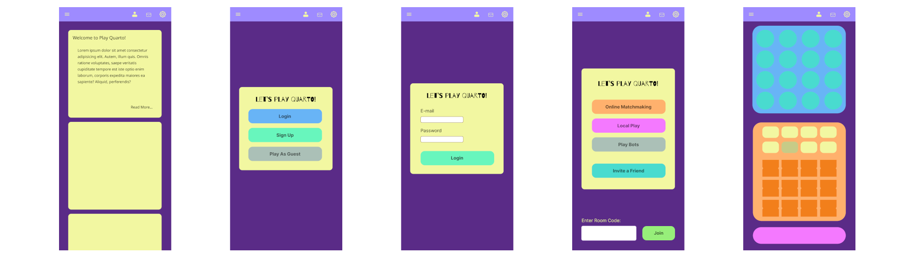

# Report #0: Mock-Ups, User Flow, and a Static Layout

## Summary

This past week or so has been spent focusing heavily on making a solid user experience on first launch. The mock ups are rough enough to poke an eye out and the static layout as abrasive as a porcupine, but the experience I have been massaging out is going well.

Below I will walk through some of what is going on behind the scenes and the rationale behind it.

## Mock-Ups

Visually beautiful designs are not in my natural wheelhouse and I try to be as efficient with my time as I can. Because of that, the mock-ups in their current form are best digested through their visual representation alongside some key talking points.

|Color|Element|Features|
|-|-|-|
|Yellow|Navigation|Can be left or right aligned on horizontal layouts
|Green|Game Board|Must always maintain a 1:1 aspect ratio
|Teal|Piece Selection|
|Pink|Chat or Chat Bar|Can exist as a Chat Bar that opens the Chat Room or is the Chat Room itself

All elements except the navigation are meant to be swappable. 



On phones (P1), this means that if the user wants to put the Chat Bar above the Game Board, then they should be able to. This is because one of my rules in designing user experiences is to provide the user with as much flexibility as possible.

This introduces a few complexities now and later down the road. For now, we'll focus on the fact that all of these different layouts come out to # foundational layouts.

Equally Shared Column|Exclusive Column|Exclusive Row|Shared Row|Single Column|Single Row|Tapered Column
:-:|:-:|:-:|:-:|:-:|:-:|:-:
||||||

Thankfully, by identifying these layouts now, it is clear that our front-end is going to benefit from utilizing CSS grid features. The only layout that won't really benefit from this is the vertical and horizontal phone layout (and those that emulate it). For this, we use flex features in CSS.

Because of the two outliers, the live static mock up starts with the vertical phone layout and includes a brief glance at the chat room, which was not mocked as it seemed pretty straight forward.



At first, live static mock ups may seem like double work, but I find it allows me to focus on the HTML/CSS required for layout. This helps with identifying CSS variables and important CSS selectors needed to be for future color changes.

This allows anyone with an editor that has CSS color picking available (like VS Code) to make color edits. This also exposes everything we need to utilize CSS layers to make creating new official themes a breeze.

All of this helps minimize backtracking and refactoring and makes designing a database structure that supports user themeing much easier.

If you were wondering why the colors in the live static mock up has the coloring it does, it is because of this beautiful CSS rule:

```
div {
    background-color: lightgreen;
    border-color: red;
    border-width: 1px;
    border-style: outset;
}
```

Different colors are only used to prevent eye fatigue from staring at what would otherwise be a wireframe.

Finally, we were able to cap the week off with a broad idea of what the main user flow is going to be.



Users will not be required to create an account, but if they don't, they will need to choose to play as a guest. Having an account and logging in is nice because it means you simply get to see the main menu, which will offer casual matchmaking, local play, or playing against bots.

Alongside the different play environments, users will be able to invite a friend to play or enter a room code to join someone else!

Whichever the user chooses, this lands them on the game board, which is where I want users to exist an overwhelming majority of the time. So much so that, when the time comes, users will be able to swap between local, bot, and various matches between players using the navigation menu.

Allowing users to decide if they land on the home page or one of the various modes when they first load (and log) in is another way I am aiming to give user's the ability to tailor their experience.

## Reflection

This might come as a shocker to some, but Visual Design is not at the top of my natural abilities. This week has felt very slow as I've hammered out visual details, but we will be walking into the next week feeling ready to tackle the horizontal phone layout in the live static mock, and setting up the foundations for the grid.

I won't be focused on allowing users to swap between the various layout options, but I will be setting up the fundamental pieces that will make it easy to implement (alongside choosing themes) when we get to implementing a settings menu.

I will also be deciding on what layouts will be considered default and with any luck we will be marching directly towards migrating to VueJS.